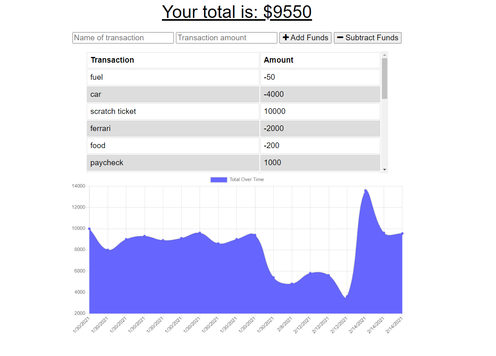

# PWA Budget Tracker 

## Project Description

This will track your budget on incoming and outgoing transactions. It will work online and offline, and you are able to download it to your desktop or as a phone application.

## Table of Contents

- [Installation](#installation)
- [License](#license)
- [Questions](#questions)

## Installation

npm i

## License

This project requires the MIT license.

## Questions?

Contact me by GitHub or Email:

- GitHub username: [scmcphee9](https://github.com/scmcphee9)
- Email Address: scmcphee9@gmail.com
